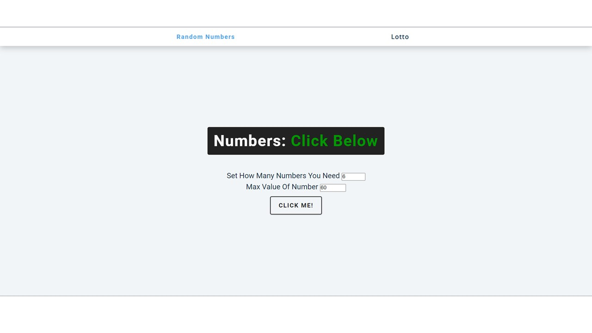

# Lottery Random Numbers Generator

Simple project using HTML, CSS and Javascript.

## Description

get pseudo-random numbers with the parameters set by user.

## How to use

- choose min and max values.
- choose numerber of numbers.
- Click on the "Click me!" button.

## Acknowledgments

Inspiration, code snippets, etc.

- [john-smilga Javascript Projects](https://github.com/john-smilga/javascript-basic-projects/tree/master/01-color-flipper)

## Screenshot

